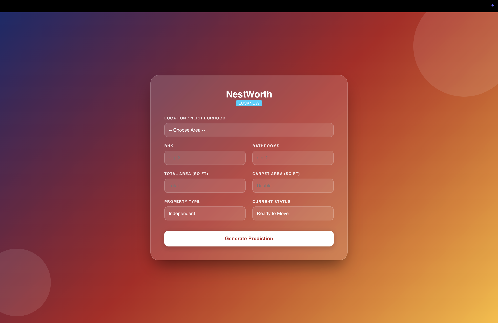
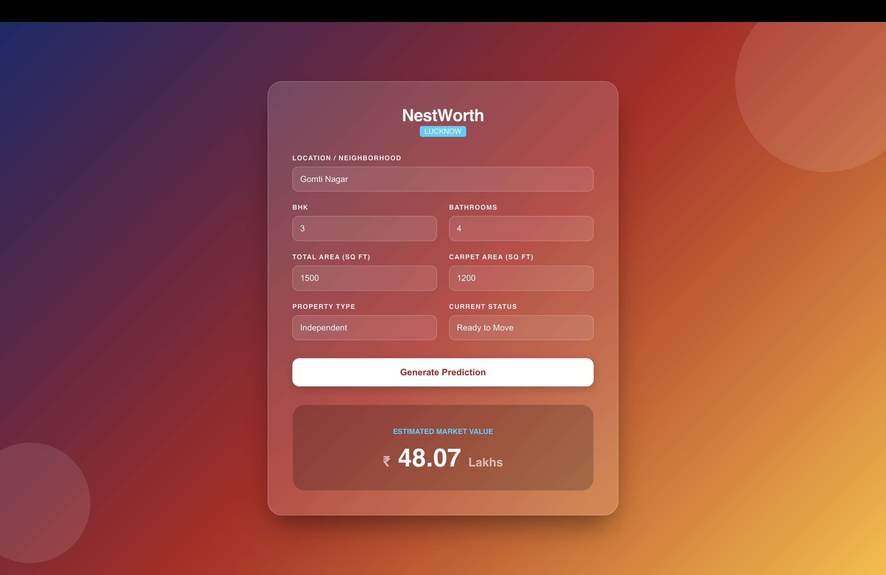

# 🏠 NestWorth – House Price Prediction System

A full-stack Machine Learning web application that predicts residential property prices in **Lucknow** using an ensemble of machine learning models.


---

## 🚀 Live Demo

### Frontend
https://YOUR-VERCEL-URL.vercel.app

### Backend API
https://YOUR-RENDER-URL.onrender.com

---

## 📖 Overview

NestWorth is an AI-powered property price prediction platform built using:

- React.js frontend
- Flask REST API
- Ensemble Machine Learning model
- Deployment on Vercel and Render

Users can enter property details such as:

- Location
- BHK
- Bathrooms
- Total Area
- Carpet Area
- Property Type
- Construction Status

The application predicts the estimated market value in Lakhs.

---

# ✨ Features

- Modern responsive UI
- Location dropdown populated from dataset
- Ensemble ML prediction
- REST API
- Real-time prediction
- Cloud deployment
- Cross-Origin enabled (CORS)

---

# 🧠 Machine Learning Model

The prediction is generated using an ensemble of:

- XGBoost Regressor
- Random Forest Regressor
- Linear Regression

Final Prediction:

```
50% XGBoost
30% Random Forest
20% Linear Regression
```

---

# 🏗 Project Structure

```
House-Price-Prediction
│
├── backend
│   ├── app.py
│   ├── model.pkl
│   ├── train_model.py
│   ├── lucknow_dataset.csv
│   └── requirements.txt
│
├── frontend
│   ├── src
│   ├── public
│   ├── package.json
│   └── ...
│
└── README.md
```

---

# ⚙️ Tech Stack

### Frontend

- React.js
- CSS
- Fetch API

### Backend

- Flask
- Flask-CORS
- Pandas
- NumPy

### Machine Learning

- Scikit-Learn
- XGBoost
- Random Forest
- Linear Regression

### Deployment

- Vercel
- Render
- GitHub

---

# 📊 Input Parameters

| Feature | Description |
|----------|-------------|
| Location | Area in Lucknow |
| BHK | Number of Bedrooms |
| Bathrooms | Number of Bathrooms |
| Total Area | Total Area (sq ft) |
| Carpet Area | Carpet Area (sq ft) |
| Property Type | Apartment / Independent etc. |
| Status | Ready to Move / Under Construction |

---

# 🔥 API Endpoints

### Get Locations

```
GET /locations
```

Returns all available locations.

### Predict Price

```
POST /predict
```

Example JSON

```json
{
    "location":"Gomti Nagar",
    "bhk":3,
    "bathrooms":2,
    "area_sq_ft":1500,
    "carpet_area":1200,
    "type":"Independent",
    "status":"Ready to Move"
}
```

Response

```json
{
    "price":48.07
}
```

---

# 💻 Run Locally

## Clone Repository

```bash
git clone https://github.com/kshitizmishra5151/House-Price-Prediction.git
```

## Backend

```bash
cd backend

pip install -r requirements.txt

python app.py
```

Runs on

```
http://localhost:5001
```

---

## Frontend

```bash
cd frontend

npm install

npm start
```

Runs on

```
http://localhost:3000
```

---

# 📸 Screenshots

### 🏠 Home Page



---

### 📈 Prediction Result



---

# 👨‍💻 Author

**Kshitiz Mishra**

GitHub:
https://github.com/kshitizmishra5151

LinkedIn:
(Add your LinkedIn)

---

# 📄 License

This project is developed for educational and portfolio purposes.